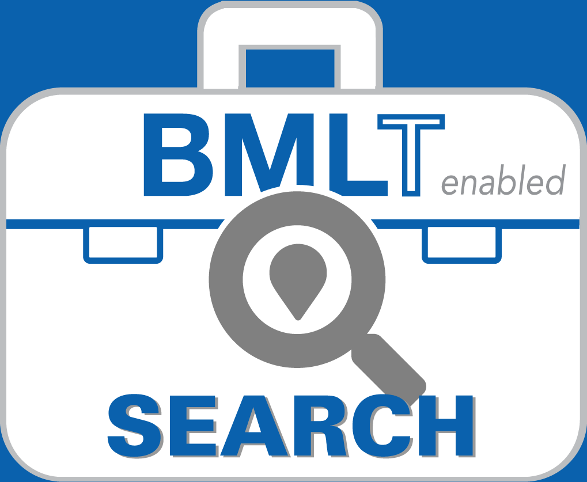

<p align="center">
  
</p>

<h1 align="center">BMLT Search</h1>

<p align="center">
  <a href="https://github.com/bmlt-enabled/BMLTSearchSvelte/actions/workflows/ci.yml"></a>
  <a href="https://app.bmlt.app"></a>
  <a href="https://bmlt.app/"></a>
</p>

<p align="center">
  <strong>👉 Try it:</strong> <a href="https://app.bmlt.app">app.bmlt.app</a>
</p>

Find Narcotics Anonymous meetings worldwide — in person, hybrid, and online — from the [BMLT](https://bmlt.app/). One codebase runs as a web app, an iOS app, and an Android app.

## Where to get it

| Platform    | Where                                                                                                              |
| ----------- | ------------------------------------------------------------------------------------------------------------------ |
| **Web**     | [app.bmlt.app](https://app.bmlt.app) — installable as a PWA                                                        |
| **iOS**     | TestFlight beta                                                                                                    |
| **Android** | Signed APK from the [latest build](https://github.com/bmlt-enabled/BMLTSearchSvelte/actions/workflows/android.yml) |

## Features

- **Four ways to search** — near your current location, by typed city / postal code / address, by panning a map, or by browsing the full service body tree
- **In-person and online** — every search covers in-person, hybrid and online meetings from the worldwide [BMLT aggregator](https://aggregator.bmltenabled.org), with a filter to narrow to one or the other
- **Meeting detail** — directions, virtual join links, phone dial-in, formats, and a share sheet
- **Correct times for online meetings** — a meeting's time is shown in its own timezone, labelled, rather than silently converted
- **Nine languages** — English, Español, Français, Italiano, Dansk, Polski, Português, Русский, and فارسی (with right-to-left layout)
- **No account, no analytics** — requests go to the BMLT aggregator, Google Maps, and Google Fonts, and nowhere else

## Contributing

Setup, commands, architecture, and the Google Maps key model are in **[CONTRIBUTING.md](.github/CONTRIBUTING.md)**.

```bash
npm install
cp .env.example .env      # then add your Google Maps keys
npm run dev               # http://localhost:5173
```

Everything except the map screen works without keys.

## Need help?

- 🐛 **Bug or feature request:** open an issue on [GitHub](https://github.com/bmlt-enabled/BMLTSearchSvelte/issues)
- 🔒 **Security issue:** see [SECURITY.md](.github/SECURITY.md) — please don't open a public issue
- 📧 **Email:** [help@bmlt.app](mailto:help@bmlt.app)
- 💬 **Community:** the [BMLT Facebook group](https://www.facebook.com/groups/bmltapp/)

## License

[MIT](LICENSE) © BMLT Enabled
